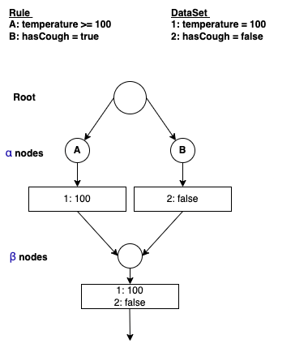

## Rete Algorithm

A Fast Algorithm for the Many Pattern and Many Object Pattern Match Problem. 

This was PhD work of Charles L. Forgy at Department of Computer Science, Carnegie-Mellon University first published in a working paper in 1974, and later elaborated in his 1979 Ph.D. thesis and a 1982 paper.

The algorithm was developed to efficiently apply many rules or patterns to many objects, or facts, in a knowledge base. It is used to determine which of the system's rules should fire based on its data store, its facts.

Details about the algorithm and the paper can be found [here](./research/RETE%20Match%20Algorithm.pdf).

## Implementing A Rule Engine using Rete Algorithm

The current project shows how to implement Rules Engine using Rete Algorithm using a [evrete library](https://www.evrete.org/).

As per the library "Evrete is a standard-compliant, lightweight, open-source, and developer-friendly Java Rule Engine for goals of any size and complexity."

Rule engines are predominantly known as software layers that allow people to change the business logic without IT intervention. Evrete provides a powerful means to develop and bring to life domain-specific rule languages.

## Use-Case

Let us consider a use case where we apply a set of business rules to determine if a person has fever, cough or both fever and cough. 

Even such a simple use case translates to the following business rules (8 rules).
* Fever if his temperature is >= 100F
* No fever if his temperature is < 100F
* Cough if he is coughing
* No Cough if he is not coughing
* Has both Fever and Cough if he is coughing and temperature >= 100F
* Has only Fever and no Cough if he is not coughing and temperature >= 100F
* Has no Fever and only Cough if he is coughing and temperature < 100F
* Has no Fever and no Cough if he is not coughing and temperature < 100F

## Rule Engine Evaluation with Rete Algorithm

The Rete algorithm is an algorithm that organizes its data in a tree-like structure. Each node in the tree represents a test which will get performed against data being added or removed from memory. Each node will have one or two inputs and possibly many outputs. As a new piece of data enters the tree, it is filtered through the tree until it reaches a terminal node. If a terminal node is reached, this means that a new activation record is created with all the data points which caused the rule to be true. Rules in Rete systems work best if you can be as explicit as possible. This means you should write rules that look for very detailed items in a given piece of data. This causes a path in the Rete tree to be traversed in a somewhat determinant manner, which exposes the efficiencies inherent to the Rete algorithm.

Any typical rule engine would consist of 
* Set of Rules
* Working Memory
* Inference Engine

The Rules are matched against the working memory. This would convergence to some data on which further action needs to be performed. If there are multiple conflicts in the rules, the conflict resolution is done. Once the resolve is completed, the rule and what needs to be executed on the rule is identified. The rules identified are executed. This either creates new data or modifies the existing one. The cycle repeats again.

For the current example, it would look like



For more details please refer the [rete algorithm paper](./research/RETE%20Match%20Algorithm.pdf).

## Implementation using evrete

* Crete a new maven project
* Add the following dependencies in pom.xml
```xml
<!-- evrete dependencies -->

<!-- core library -->
<dependency>
    <groupId>org.evrete</groupId>
    <artifactId>evrete-core</artifactId>
    <version>2.2.01</version>
</dependency>

<!-- Annotated Java rules -->
<dependency>
    <groupId>org.evrete</groupId>
    <artifactId>evrete-dsl-java</artifactId>
    <version>2.2.01</version>
</dependency>
```
* The code uses [Patient.java](./src/main/java/com/vensr/evrete/model/Patient.java) to define a patient, [Report.java](./src/main/java/com/vensr/evrete/model/Report.java) to define a report for the patient that contains his data on his temperature and cough and [Diagnosis.java](./src/main/java/com/vensr/evrete/model/Diagnosis.java) that contains report that needs to be diagnosed for classifying the disease using rules.
* There are 2 ways to define rules, using a builder syntax provided as a part of your java code or using annotations.
* For details on how the rules are defined in the builder syntax refer the file [DiseaseRulesBuilder.java](./src/main/java/com/vensr/evrete/rules/builder/DiseaseRulesBuilder.java). The code is self explanatory.

```java
    private Knowledge buildRules() {
        return knowledgeService
            .newKnowledge()
                // Rule 1: Set no disease by default
                .newRule("No Disease Rule")
                .forEach(
                    "$d", Diagnosis.class)
                .execute(ctx -> {
                    Diagnosis diagnosis = ctx.get("$d");
                    diagnosis.setHasCough(false);
                    diagnosis.setHasFever(false);
                })
                // Rule 2: if temperature >= 100 then fever
                .newRule("Fever Rule")
                .forEach(
                    "$d", Diagnosis.class,
                    "$r", Report.class)
                .where("$d.patient == $r.patient")
                .where("$r.temperature >= 100")
                .execute(ctx -> {
                    Diagnosis diagnosis = ctx.get("$d");
                    diagnosis.setHasFever(true);
                })
                // Rule 3: if temperature < 100 then no fever
                .newRule("No Fever Rule")
                .forEach(
                    "$d", Diagnosis.class,
                    "$r", Report.class)
                    .where("$d.patient == $r.patient")
                    .where("$r.temperature < 100")
                    .execute(ctx -> {
                        Diagnosis diagnosis = ctx.get("$d");
                        diagnosis.setHasFever(false);
                    })
                // Rule 4: if person is coughing, then cough
                .newRule("Cough Rule")
                .forEach(
                    "$d", Diagnosis.class,
                    "$r", Report.class)
                    .where("$d.patient == $r.patient")
                    .where("$r.hasCough == true")
                    .execute(ctx -> {
                        Diagnosis diagnosis = ctx.get("$d");
                        diagnosis.setHasCough(true);
                    })
                // Rule 5: if person is not coughing, then no cough
                .newRule("No Cough Rule")
                .forEach(
                    "$d", Diagnosis.class,
                    "$r", Report.class)
                    .where("$d.patient == $r.patient")
                    .where("$r.hasCough == false")
                    .execute(ctx -> {
                        Diagnosis diagnosis = ctx.get("$d");
                        diagnosis.setHasCough(false);
                    });
        }

```
* For details on how the rules are defined using annotations refer the file [DiseaseAnnotatedRulesBuilder.java](./src/main/java/com/vensr/evrete/rules/builder/DiseaseAnnotatedRulesBuilder.java). In this case, rules are defined in an external location.

```java
package com.vensr.evrete;

import org.evrete.dsl.annotation.Rule;
import org.evrete.dsl.annotation.RuleSet;
import org.evrete.dsl.annotation.Where;

import com.vensr.evrete.model.Diagnosis;
import com.vensr.evrete.model.Report;

@RuleSet(value = "Disease Rule Set", defaultSort = RuleSet.Sort.BY_NAME)
public class DiseaseRules {

    @Rule()
    public void rule1_setNoDisease(Diagnosis $d) {
        $d.setHasCough(false);
        $d.setHasFever(false);
    }

    @Rule()
    @Where("$d.patient == $r.patient && $r.temperature >= 100")
    public void rule2_feverRule(Diagnosis $d, Report $r) {
        $d.setHasFever(true);
    }

    @Rule()
    @Where("$d.patient == $r.patient && $r.temperature < 100")
    public void rule3_noFeverRule(Diagnosis $d, Report $r) {
        $d.setHasFever(false);
    }

    @Rule()
    @Where("$d.patient == $r.patient && $r.hasCough == true")
    public void rule4_coughRule(Diagnosis $d, Report $r) {
        $d.setHasCough(true);
    }

    @Rule()
    @Where("$d.patient == $r.patient && $r.hasCough == false")
    public void rule5_noCoughRule(Diagnosis $d, Report $r) {
        $d.setHasCough(false);
    }

}

```
You can also keep the rules remotely. Here is a [link to the same set of rules on github](https://gist.github.com/vensr/2eeda86b9fa5e7218060a6ca47068c22).

* Refer to the test cases in the file [DiseaseRulesTests.java](./src/test/java/com/vensr/evrete/rules/builder/DiseaseRulesTests.java) for all the test cases and how to run the tests.
* Refer to [DiseaseRulesBuilderTest.java](./src/test/java/com/vensr/evrete/rules/builder/DiseaseRulesBuilderTest.java) for running tests where rules are built using the builder method.
* Refer to [DiseaseAnnotatedRulesBuilderTest.java](./src/test/java/com/vensr/evrete/rules/builder/DiseaseAnnotatedRulesBuilderTest.java) for running tests where rules are built using the annotated method.

